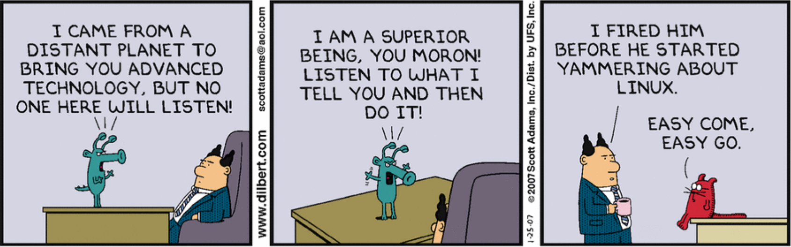

# Introduction


My online command line notes pulled from various internet resources.    
  
**Use at your own risk.**  


### **Reading Outcomes**

* Essential Linux concepts necessary for managing remote servers or virtual machine environments. 
* Understanding of internet networking concepts and system configuration strategies.  
* Build familiarity of setup and configuration techniques of Amazon EC2 Instances.

It will be up to the reader to expand upon information provided in order to configure server that suits their project/team objectives.

## Command Line Interface \(CLI\) vs Graphical User Interface \(GUI\)

Concept and environment configuration guides that are covered will be focused on the CLI. 

* For users unfamiliar with the command line, it is worthwhile to spend ample time becoming familiar with system and user level commands.  
* Despite the steep learning curve, being able to automate tasks with scripts and full permission control of your system can drastically developer productivity. 

| **Basis of comparison between GUI vs CLI** |                          **GUI** |                          **CLI** |
| :--- | :--- | :--- |
| `Basic` | This user interface enables the user to interact with electronic devices with the help of graphical icons and visual indicators. | This user interface enables a user to give a command  to interact with an electronic  device |
| `Ease of understating` | The graphical user interface is visually intuitive. It is easy to understand for beginners | Due to the need to remembering commands, it is difficult to handle and requires expertise. |
| `Memory Requirement` | It requires more memory as it consists of a lot of graphical components. | It requires less memory as compared to GUI. |
| `Speed` | It generally uses a mouse to execute commands. The speed of GUI is Slower than CLI. | Because the keyboard is used to execute the commands, the speed of the CLI is Faster than GUI |
| `Appearance` | One can change the appearance with a customizable option. |  It is not possible to change the appearance |
| `Flexibility` | More flexible than CLI | Less flexible than GUI |
| `Device used` | Keyboard and mouse | Keyboard |
| `Precision` | Low as compared to the CLI | High as compared to the GUI |


Content pulled from **educba.com**.

\*\*\*\*[**Original Page**](https://www.educba.com/gui-vs-cli/)\*\*\*\*


