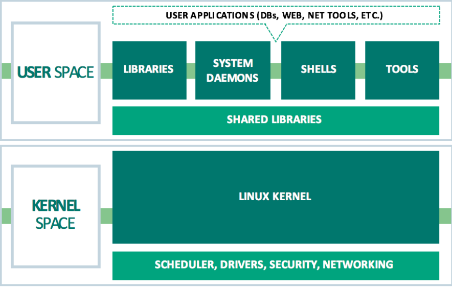
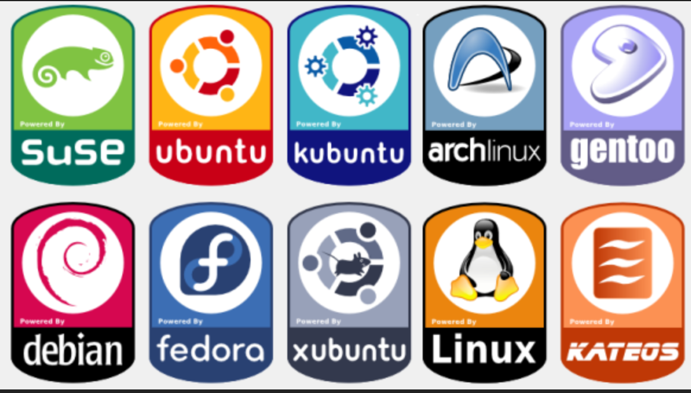

# Background

Named after its creator, [Linus Torvalds](https://en.wikipedia.org/wiki/Linus_Torvalds), Linux is an operating system made available to the world for free.

In contrast to proprietary software, Linux is a free and open-sourced OS, anyone is freely licensed to use, copy, study, and change the software in any way. The code behind open-source software are publicly shared and often encourage developers to voluntarily improve the design of the software.

## System Architecture

The Linux operating system is created from three primary building blocks:

* **Kernel** - The kernel is the core of Linux operating system. It is responsible for the interaction of applications running on the _user-space_  to the hardware level of the computer. The kernel is the part of the operating system that manages CPU hardware, allocates memory, accesses data, schedules processes, and running applications. 
* **System Library** - System libraries are special functions or programs using which application programs or system utilities accesses Kernel's features. These libraries implement most of the functionalities of the operating system and do not requires kernel module's code access rights.
* **System Utility** - These are individual programs or scripts designed to for specialized, individual tasks.

## User Space vs. Kernel Space

To better understand the appeal of Linux for web servers, Linux systems segregates virtual memory into Kernel Space and User Space. Critical code that keeps the system running live within the Kernel. Alteration of these processes would cause a system failure.

User applications that run on the user space are comprised of various libraries, device drivers, applications, and [System daemons](https://www.freedesktop.org/software/systemd/man/daemon.html) \(programs that run in the background and responsible for responding to network requests\).

To ensure the Linux system is as reliable and secure an operating system as possible, the kernel is loaded into protected areas of memory so critical code and system processes cannot be overwritten by other applications running in the operating system.

### Source

* [https://cumulusnetworks.com/blog/linux-architecture/](https://cumulusnetworks.com/blog/linux-architecture/) 

## Linux Distros

_Distros_ is short for _distributions_ when used to describe a specific Linux environment. These are operating systems that run off the Linux kernel. Typically, a distro will come will a set of bundled software with basic applications pre-installed. Distros are categorized by their package management system. Some of the more popular distos are:

* RPM-based
* Debian-based
* Pacman-based

You can find more information on distributions from [Wikipedia](https://en.wikipedia.org/wiki/List_of_Linux_distributions)

|  |
| :--- |

**Sources**

* [https://www.systutorials.com/linux-manuals/](https://www.systutorials.com/linux-manuals/)
* [https://www.linux.com/what-is-linux/](https://www.linux.com/what-is-linux/)
* [https://lifehacker.com/how-to-get-started-with-the-linux-operating-system-1819644874](https://lifehacker.com/how-to-get-started-with-the-linux-operating-system-1819644874)

