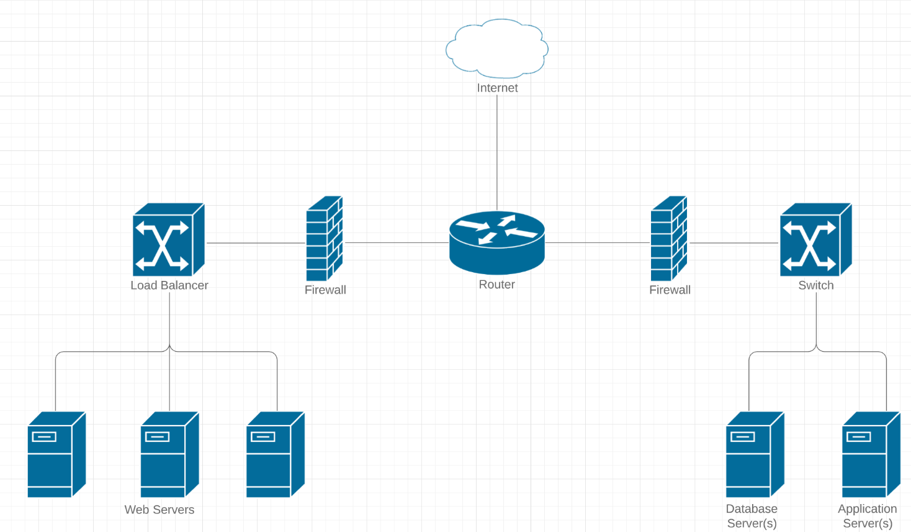

# Introduction

## Introduction

Before you can configure your remote server instance, it is important to understand common terms that you will encounter regularly.

Recommended Reads : [Website Terminology](https://www.pagecloud.com/blog/website-terminology), [Stateless vs Stateful Protocols](https://www.geeksforgeeks.org/difference-between-stateless-and-stateful-protocol/)

_Networking_ refers to what information is intended or not intended to be transferred through a network. This process of transferring information is called a **Connection.** The chunks of information transferred over a network known as **Packets.**

## Step by Step

