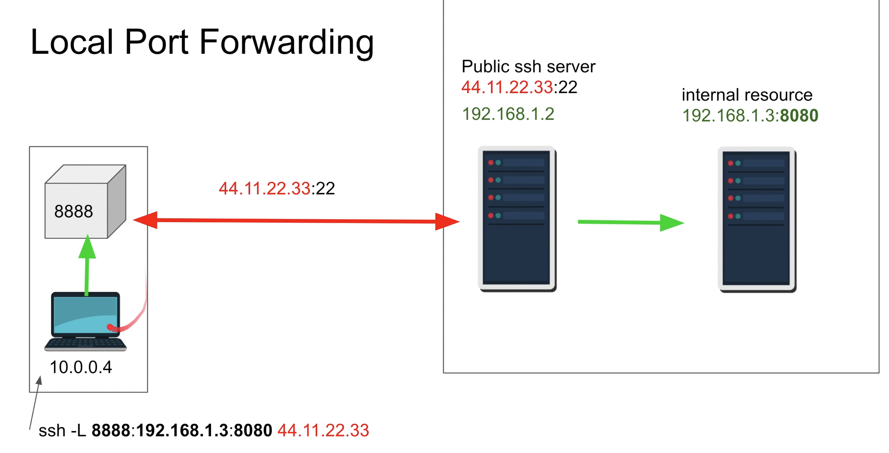

# Local Port Forwarding

## Local Port Forwarding

* I want to access remote resources that I can't access
* Internal Remote Database, RDP



```text
ssh -L local_port:destination_server_ip:remote_port ssh_server_hostname
```

⦁ **`ssh`** – Starts the SSH client program on the local machine and establishes a secure connection to the remote SSH server.

⦁ **`-L local_port:destination_server_ip:remote_port`** – The local port on the local client is being forwarded to the port of the destination remote server.

⦁ **`ssh_server_hostname`** – This element of the syntax represents the hostname or IP address of the remote SSH server.

